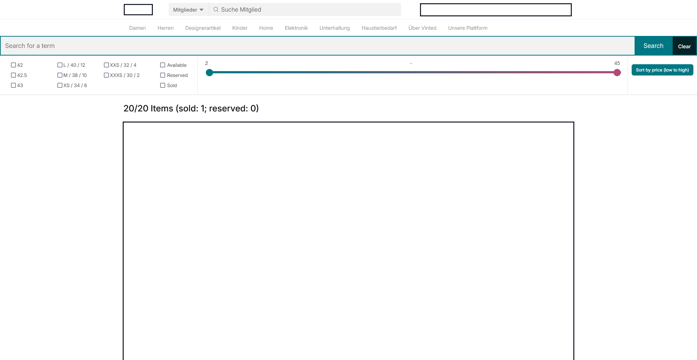

# favorites_filter

You can easily filter your favorites on Vinted by size, availability and search term and sort by price with this browser addon.

## Requirements

- Firefox or Chrome

Both browsers are served from the same codebase and the same manifest.

## Features

- Filter by size
- Filter by availability
- Filter by search term
- Filter by price
- Sort by price

## Future features

- Save and load items (basically load all favorites at once)
- Highlight items with certain keywords/brands/sizes (maybe)

## Install

**Firefox:** [Add it to Firefox](https://addons.mozilla.org/de/firefox/addon/filter-favorites/)

**Chrome:** not on the Chrome Web Store due to the registration fee. Download `extension.zip` from the [releases](https://github.com/tobiasfrck/favorites_filter/releases), unpack it, then load the folder via `chrome://extensions` with developer mode enabled.

## Screenshots

## Disclaimer
The code quality may not be the best as I this is my first browser addon and I just wanted to try some stuff.
