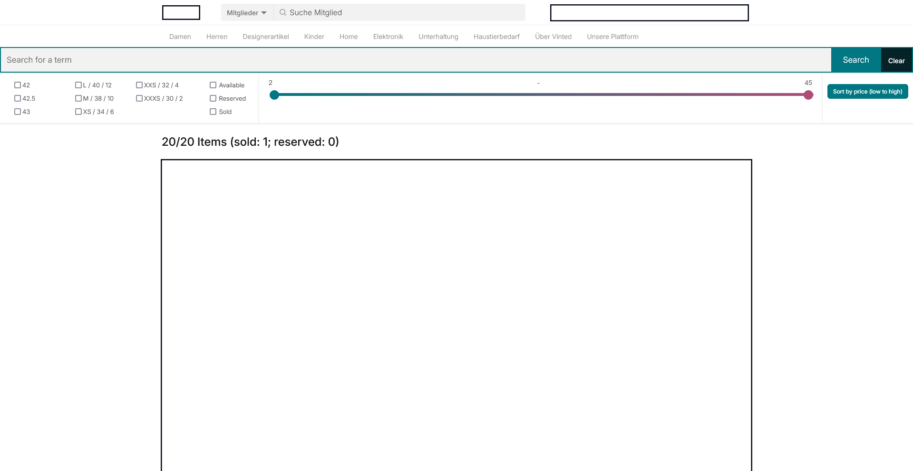

# favorites_filter

You can easily filter your favorites on Vinted by size, availability and search term and sort by price with this firefox addon.

## Requirements

- Firefox

The Chrome version is available [here](https://github.com/tobiasfrck/favorites_filter/tree/chrome-version) but will receive delayed updates and will probably not be on the chrome store due to the registration fee.

## Features

- Filter by size
- Filter by availability
- Filter by search term
- Filter by price
- Sort by price
- Display more/less items per row with Numpad +/-

## Future features

- Save and load items (basically load all favorites at once)
- Highlight items with certain keywords/brands/sizes (maybe)

## Install

[Add it to Firefox](https://addons.mozilla.org/de/firefox/addon/filter-favorites/)

## Screenshots

## Disclaimer
The code quality may not be the best as I this is my first browser addon and I just wanted to try some stuff.
